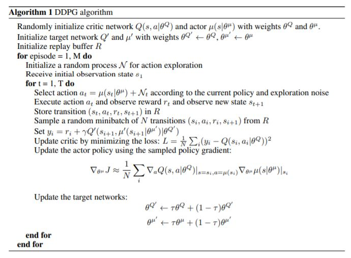
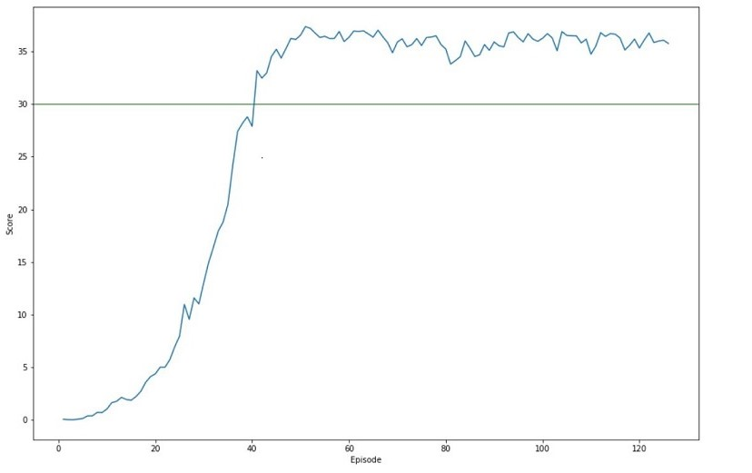

# Summary

This report documents the course project 'Continuous Control' where you train an agent to control a double-jointed arm, to reach target locations.

## Problem

A reward of +0.1 is provided for each step that the agent's hand is in the goal location. Thus, the goal of your agent is to maintain its position at the target location for as many time steps as possible.

The observation space consists of 33 variables corresponding to position, rotation, velocity, and angular velocities of the arm. Each action is a vector with four numbers, corresponding to torque applicable to two joints. Every entry in the action vector should be a number between -1 and 1.

In this problem, there are 20 identical agents, each with its own copy of the environment.
In order to solve, your agents must get an average score of +30 (over 100 consecutive episodes, and over all agents).

## Solution

Based on the provided hints, [Deep Deterministic Policy Gradient(DDPG)](https://arxiv.org/abs/1509.02971) was selected to solve the problem of continous control.

### Learning Algorithm

[Deep Deterministic Policy Gradient (DDPG)](http://proceedings.mlr.press/v32/silver14.pdf) is model-free algorithm based on the deterministic policy gradient that can operate over continuous action spaces. DDPG can be thought of as being Deep Q-learning for continous action spaces. 
DDPG is an algorithm which concurrently learns a Q-function and a policy. It uses off-policy data and the Bellman equation to learn the Q-function, and uses the Q-function to learn the policy. \
Actor function specifies action 'a' given the current state of the environment 's'. \
Critic value function specifies a signal to evaluate the actions made by the Actor.\

DDPG involves deterministic policies, which take a state and return a single action (no stochasticity).



In this implementation, there are two neural networks(local and target) each for Actor and Critic. \
Number of hidden layers: 2 \
Hidden Layer 1: 256 units \
Hidden Layer 2: 128 units \
Activation function(both layers): ReLU

Ornstein-Uhlenbeck noise is injected in the action space as per the DDPG paper better Exploration.

Replay buffer and Soft update are implemented for sample efficiency and stability.

### Plot of Rewards



### Ideas for Future Work

The performance of the Continuous Control agent can be improved by experimenting with below ideas:
 1. Implement [Trust Region Policy Optimization(TRPO)](https://arxiv.org/abs/1502.05477) as suggested in [Benchmarking Deep Reinforcement Learning for Continuous Control](https://arxiv.org/abs/1604.06778) paper.
 2. Implement [Q-Prop: Sample-Efficient Policy Gradient with An Off-Policy Critic](https://arxiv.org/abs/1611.02247) for substantial gains in sample efficiency over trust region policy optimization (TRPO), and improved stability over deep deterministic policy gradient (DDPG) algorithm.


```python

```
